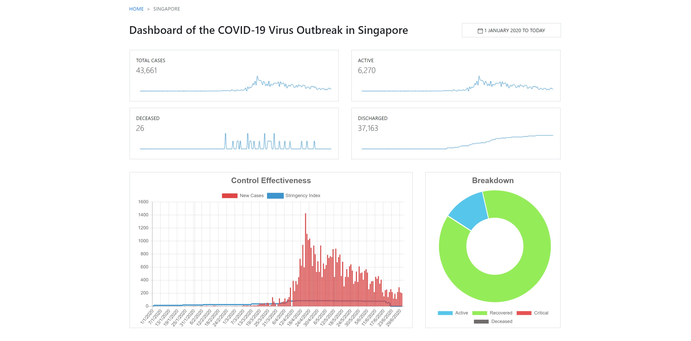

# Simple Dashboard

This simple web application is to showcase and familiarise myself with [chart.js](https://www.chartjs.org/). It is one of the great tools that allow developers to build quick and beautiful charts. Do note that as the application reads the data from a static file, information in the page is not accurate.

Layout of the page follows that of webpage [Co.vid19.sg](https://co.vid19.sg/singapore/). Data is retrieved and extracted from [ourworldindata.org](https://ourworldindata.org/coronavirus-source-data).

## Screenshot

    

